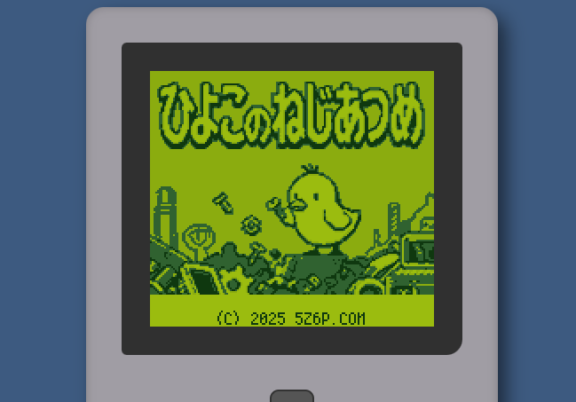

# ひよこのねじあつめ

レトロなゲームボーイ風のアクションパズルゲームです。ひよこを操作して、ねじを正しい箱に届けましょう！

**[プレイはここから](https://hsgw.github.io/hiyoko_no_neji_atsume/)**

このゲームは[ひよこアドベントカレンダー2025](https://adventar.org/calendars/11930)のために制作されました。

## 🎮 あそびかた

ひよこを操作して、ねじを同じ種類の箱に届けよう！

- ひよこは勝手に前に進みます。
- 十字キー(W/A/S/D)でひよこを操作します。
- ねじを拾うとひよこの後ろにくっつきます。
- ひよこの直後にくっついてるねじと同じマークの箱へ届けます。
- ねじと箱は２種類ずつあります。
- 同じ種類のねじを続けて拾って対応した箱に届けるとコンボボーナス！
- 違うねじを箱に届ける、壁や後ろに繋がったねじにぶつかるとゲームオーバーです。

## 🕹️ 操作方法

### キーボード

- **移動**: `↑` `↓` `←` `→` または `W` `A` `S` `D`
- **ゲーム開始 / タイトルへ戻る**: `Space`

### タッチ操作

- 画面に表示されている十字キーとボタンで操作します。

## ✨ ライセンス

MITライセンス

---

This is a browser-based prototype of a retro Game Boy-style, snake-like action puzzle game.

**Tech Stack**: HTML5, CSS, JavaScript (ES6+), Canvas API
